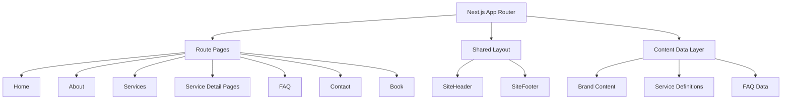
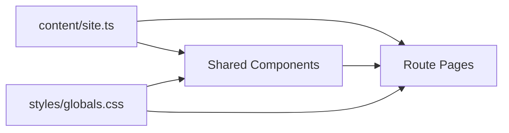
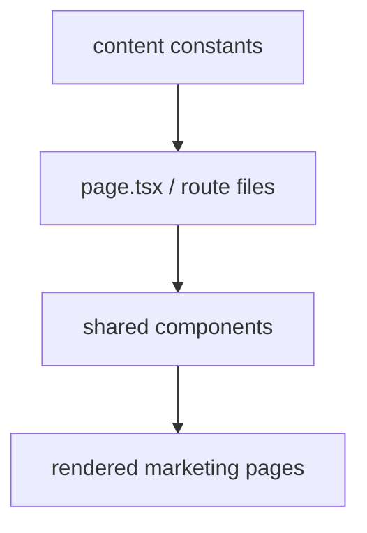

# DESIGN_qingluan-marketing-site

## 整体架构

## 分层设计

### 1. App 路由层

- 负责路由、页面元数据与页面组合
- 对应 `app/` 下各页面

### 2. 组件层

- 提供全站复用 UI 组件
- 包括 Header、Footer、SectionHeading、ServiceCard、CTASection、FAQAccordion、InquiryForm 等

### 3. 内容数据层

- 使用本地 TypeScript 常量维护服务、FAQ、导航、SEO 与首页区块内容
- 避免页面内散落硬编码

### 4. 样式系统层

- 基于 Tailwind CSS 与 CSS variables
- 提供配色、纹理、容器、按钮、卡片与版式规则

## 核心组件

- `SiteHeader`
- `SiteFooter`
- `HeroSection`
- `SectionHeading`
- `ServiceCard`
- `ProcessSteps`
- `TrustSection`
- `FAQAccordion`
- `TestimonialCard`
- `CTASection`
- `InquiryForm`
- `PageHero`

## 模块依赖关系

## 接口契约定义

### Service

- `slug: string`
- `name: string`
- `chineseName?: string`
- `tagline: string`
- `summary: string`
- `idealFor: string[]`
- `includes: string[]`
- `process: string[]`
- `deliverables: string[]`
- `pricing: string`
- `ctaLabel: string`

### FAQ Item

- `question: string`
- `answer: string`

### Testimonial Placeholder

- `name: string`
- `role: string`
- `quote: string`

## 数据流向

## 异常处理策略

- 未找到服务 slug 时返回 Next.js 404
- 所有导航链接只指向已实现页面
- 表单与预约按钮在未接入后端时明确提示“integration coming soon”
- 文案与数据集中管理，减少路由间不一致风险

## 可行性结论

- 当前项目从零搭建，采用 App Router 静态营销站点可直接落地
- 技术风险低，主要工作量集中在页面实现与视觉质量控制
- 后续可平滑扩展预约、CMS、双语与内容系统
