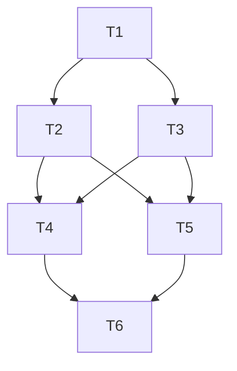

# TASK_qingluan-marketing-site

## 任务拆分

### T1：初始化前端工程骨架

- 输入契约：
  - 已确认技术栈为 Next.js + TypeScript + Tailwind
  - 仓库当前为空
- 输出契约：
  - 可运行的基础工程
  - `app/`、组件目录、内容目录、样式文件
- 实现约束：
  - 使用 App Router
  - 配置基础 lint/type 结构
- 依赖关系：
  - 为 T2-T6 前置依赖

### T2：建立全局样式与布局系统

- 输入契约：
  - 工程骨架已存在
- 输出契约：
  - 根布局
  - 主题变量
  - Header/Footer
  - 基础容器与按钮样式
- 实现约束：
  - 风格需体现东方现代感
  - 必须响应式
- 依赖关系：
  - 依赖 T1
  - 为 T3-T6 前置依赖

### T3：建立内容模型与基础复用组件

- 输入契约：
  - 工程和样式基础已存在
- 输出契约：
  - 服务数据
  - FAQ 数据
  - 复用组件
- 实现约束：
  - 使用 TypeScript 类型
  - 不在页面散落重复文案
- 依赖关系：
  - 依赖 T1、T2
  - 为 T4-T6 前置依赖

### T4：实现首页与核心营销区块

- 输入契约：
  - 复用组件和内容模型可用
- 输出契约：
  - 首页完整实现
- 实现约束：
  - 包含 AGENTS.md 要求的全部主页区块
- 依赖关系：
  - 依赖 T2、T3

### T5：实现其余路由页面

- 输入契约：
  - 内容模型可用
- 输出契约：
  - About、Services、各服务详情、FAQ、Contact、Book 页面
- 实现约束：
  - 所有链接可达
  - 元数据完整
- 依赖关系：
  - 依赖 T2、T3

### T6：补充校验与项目文档

- 输入契约：
  - 页面实现完成
- 输出契约：
  - 基础验证结果
  - README
  - ACCEPTANCE / FINAL / TODO 文档
- 实现约束：
  - 明确记录已完成项、未完成项与后续接入点
- 依赖关系：
  - 依赖 T4、T5

## 任务依赖图

## 审批检查清单

- 完整性：覆盖首页、内容页、表单占位、预约占位、SEO、文档
- 一致性：与 `AGENTS.md`、ALIGNMENT、CONSENSUS 保持一致
- 可行性：技术方案为标准静态营销站点实现路径
- 可控性：无后端依赖，风险可控
- 可测性：通过构建、静态检查、页面访问完整性进行验证
